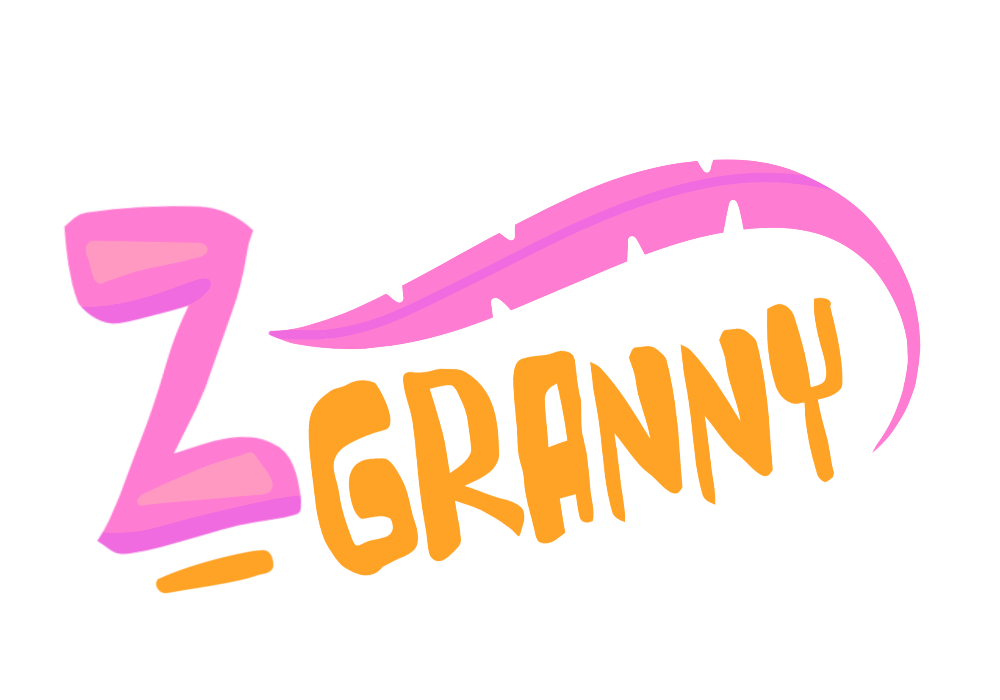
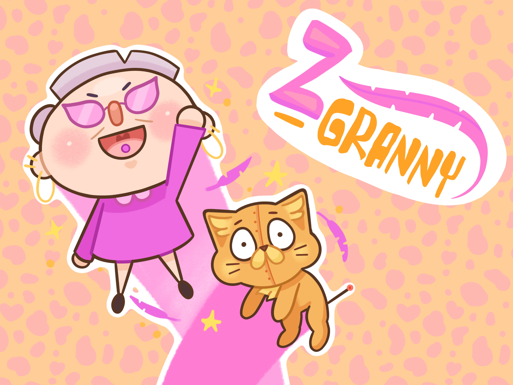
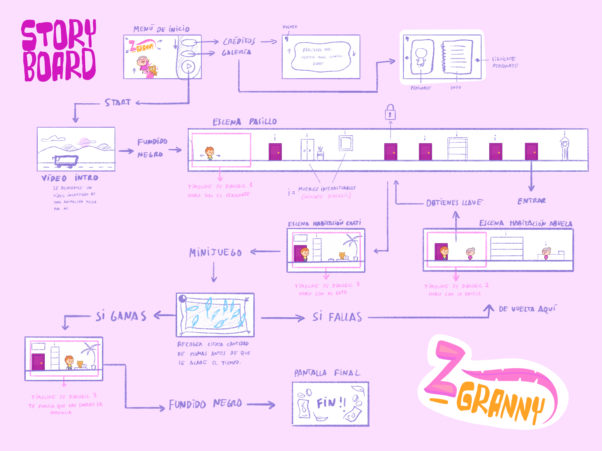

## Z-GRANNY

Proyecto de Creación Multimedia Interactiva de la  Facultad de Bellas Artes de la Univesidad de Granada

# 1 Datos 

**Titulo** : Z-GRANNY

**Web:**   (url github.io)

**Autor:**  Alberto Rocha Campillo 

 [Profile Card](cmi-card.html)  [Alternate Profile Card](cmi-card2.html)

**Resumen** : Tu abuela te envía una carta para que vayas a visitarla. Es la primera vez que vas a verla y estás muy nervioso, porque claro, estamos en el año 2092 y las cosas ya no son como antes. Una herencia, un gato IA y muchas plumas... ¿qué es lo peor que puede pasar?

**Estilo/género:**  Juego

**Logotipo** : 

**Resolución:** 1152x648px responsivo

**Probado en:**   Google Chrome

**Tamaño proyecto:** 14MB 

**Licencia** Este proyecto tiene una Licencia CC Reconocimiento Compartir igual (CC BY-SA)

**Fecha** : 27/05/2026

**Medios** (donde se tiene presencia relacionada):

- Github:
- Twitter
- Instagram

# 2. Memoria del proyecto 

### 2.1 Storyboard: 

El juego comienza con un menú con tres botones desplegables: el botón galería (te lleva a la galería con información de los personajes), el de créditos (te lleva a una pantalla con los créditos) y el botón de play. Al pulsarlo se reproduce un vídeo en el que ves cómo recibes la carta y vas en bus a ver a tu abuela. Termina la intro y te encuentras en el pasillo, donde te puedes mover hacia izquierda y derecha e interactuar con los muebles y las puertas cerradas. La última puerta te lleva a la habitación de la abuela, donde hablas con ella y te explica que al ganarte la confianza de su gato te dará toda su herencia. Al acabar este dialogo puedes interactuar con los muebles de la habitación y con el personaje de la abuela. Al salir, otra puerta del pasillo estará desbloqueada, y al entrar, podrás hablar con Chati, el gato, y te preguntará si estás listo para iniciar el minijuego. Al aceptar, te lleva a la escena del minijuego, donde debes recoger todas las plumas haciendo clic sobre ellas antes de que pasen 15 segundos. Si fallas, se te lleva de vuelta a la habitación de la abuela y vuelta a empezar. Si ganas, vuelves a hablar con Chati y te salta la imagen final, donde puedes volver al menú principal.

### 2.2. Esquema de navegación 

# 3. Metodología

Metodología de desarrollo de productos multimedia basado en una metodología de UX (User Experience)

## Etapa 1: Ideación de proyecto

**Investigación de campo** (propuestas inspiradoras para el proyecto)

- Portfolio [Leonardi Web page](http://www.rleonardi.com/interactive-resume/) para idear cómo organizar el material
- 

**Motivación de la propuesta** 

Este  proyecto es interesante porque ... 

**Publico / audiencia**

- Orientado a un púlico joven, que ronde los 18 años. Aunque apto para todo tipo de público.

## Etapa 2: Desarrollo / actividades realizadas

(qué soluciones has planteado y cómo se han resuelto: juego, galería de fotos, grabación de video, etc.)

- Juego. 
- Video 
- Instrucciones y ayuda al usuario 
- Menús y elementos de navegación (botones)
- etc.

## Etapa 3: Problemas identificados

(que consideras que no  funciona correctamente y por qué )

# 4. Conclusiones 

(explica brevemente tu valoración, problemas que has detectado y que te gustaría hacer o mejorar en el futuro )

# 5 Referencias 

**Artículos y blogs** 

- Crofts, S., Fox, M., Retsema, A. and Williams, B. (2005) *Podcasting: A new technology in search of viable business models*First Monday, 10(9). https://doi.org/10.5210/fm.v10i9.1273. Recuperado el 8 de abril de 2020 de: https://journals.uic.edu/ojs/index.php/fm/article/view/1273/1193

**Recursos y materiales audiovisuales:**

* Musica:  
* Imágenes:  
* Tipografía: 

**Herramientas utilizadas**

- Godot Engine 4.x
- 

(imagen de la licencia, copiar y pegar aquí la correcta)
https://creativecommons.org/licenses/?lang=es

* logos en https://creativecommons.org/mission/downloads/
  
  </small>

Mayo 2026
